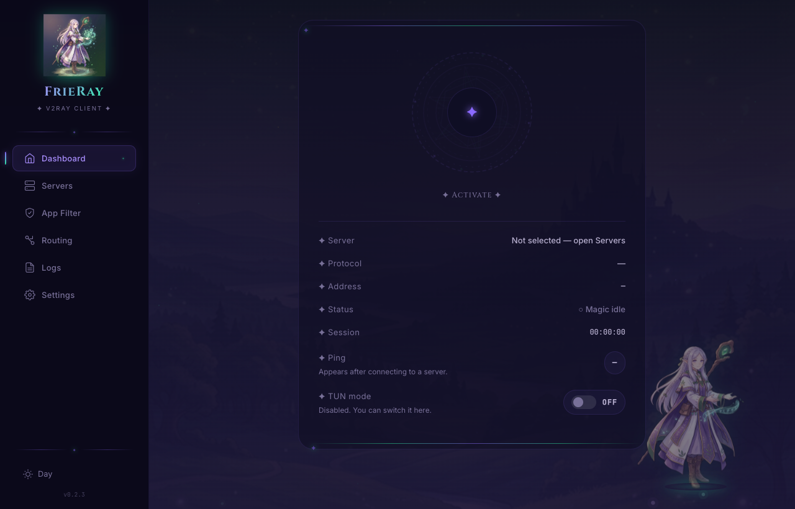
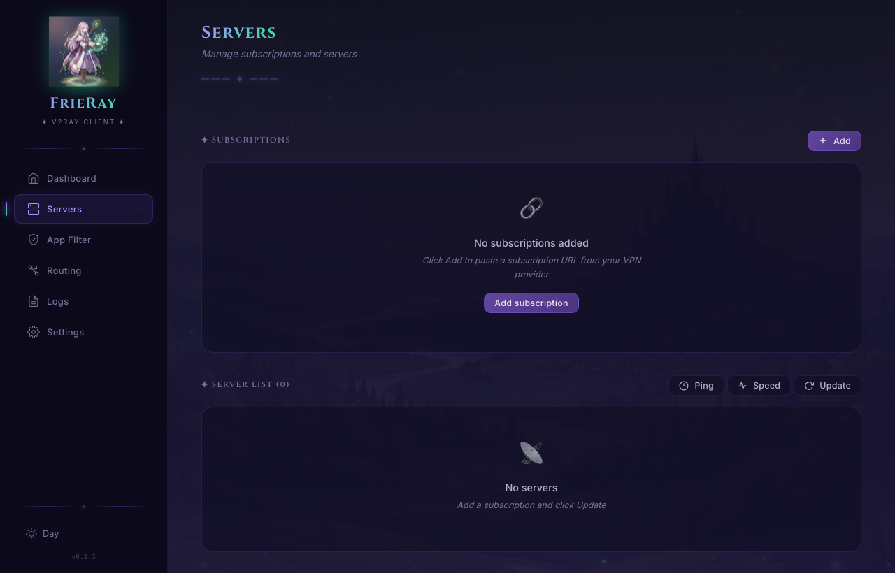
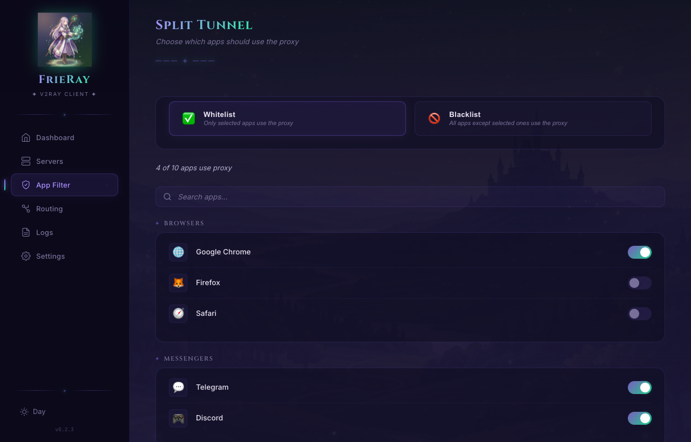
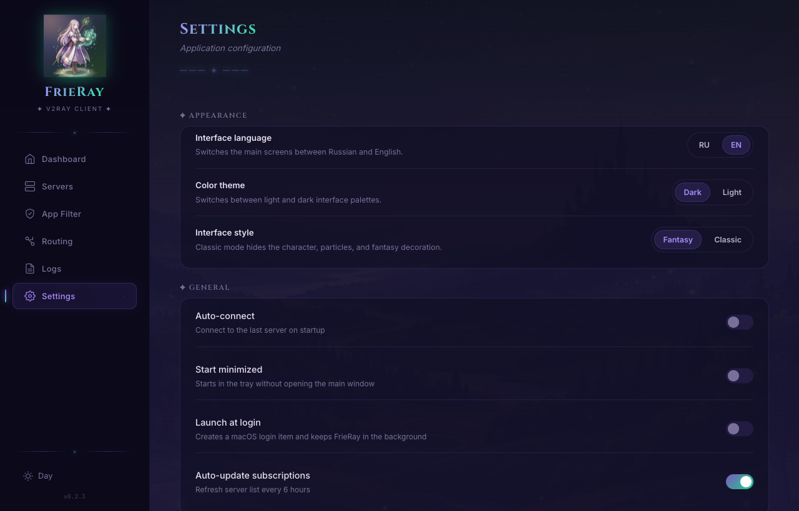

# FrieRay

[](https://github.com/MrGodgames/FrieRay/actions/workflows/ci.yml)


[](LICENSE)

FrieRay is a desktop V2Ray/Xray client for macOS built with Tauri 2, React, and Rust.

The app focuses on a practical daily workflow: importing subscriptions, selecting servers, checking ping and speed, connecting through Xray, using system proxy or full-traffic TUN mode, and controlling the connection from the macOS menu bar.

## Highlights

- VLESS, VMess, Trojan, and Shadowsocks import
- Plain text, base64, Xray/V2Ray JSON, and partial sing-box-style JSON subscription parsing
- Per-server ping scan with parallel measurement
- Per-server speed test through isolated temporary Xray instances
- Best-server quick connect from the tray popup
- macOS menu bar workflow with connect, disconnect, and auto-select actions
- System proxy mode
- Full-traffic macOS TUN mode through `tun2socks`
- App filtering / split-tunnel UI groundwork for per-application VPN rules
- Russian and English interface language switcher
- Launch at login and background tray mode
- Live logs, traffic stats, and connection diagnostics
- Light/dark themes and fantasy/classic visual modes

## Screenshots

FrieRay supports Russian and English UI. The screenshots below use the English interface for public documentation.

| Dashboard | Servers |
| --- | --- |
|  |  |

| App Filter | Settings |
| --- | --- |
|  |  |

## Roadmap focus

FrieRay is being prepared for a wider open-source roadmap: Linux and Windows ports, safer cross-platform secret storage, and per-application VPN filtering so users can route only selected apps through FrieRay. See [ROADMAP.md](ROADMAP.md) for details.

## Release

Latest prepared version: `v0.2.3`

Prebuilt macOS builds are published through [GitHub Releases](https://github.com/MrGodgames/FrieRay/releases).

Expected macOS artifact names:

```text
FrieRay_0.2.3_aarch64.dmg
FrieRay.app
```

## Supported Import Formats

FrieRay currently supports:

- `vless://`
- `vmess://`
- `trojan://`
- `ss://`
- base64-encoded subscription lists containing those links
- Xray/V2Ray JSON configs with supported `outbounds`
- selected sing-box-style JSON outbound fields such as `type`, `server`, `server_port`, `uuid`, `password`, `tls`, and `transport`

Unsupported or not guaranteed yet:

- Clash YAML
- TUIC
- Hysteria
- WireGuard
- mixed or provider-specific formats outside the supported outbound fields

## Current Status

Stable enough for personal macOS use:

- subscription management
- server list and active server selection
- Xray start/stop lifecycle
- system proxy mode
- TUN helper install/start/stop flow
- startup and exit cleanup for TUN routes, Xray, and proxy settings
- tray popup workflow
- ping and speed scans
- best-server selection

Still experimental:

- Split Tunnel UI
- routing editor
- advanced protocol edge cases
- signed update and dependency verification workflow

## Security Notes

FrieRay is a local VPN/proxy client and handles sensitive data such as subscription URLs, server UUIDs, passwords, and generated Xray configs.

Current protections:

- HTTPS is required for remote subscription URLs
- local app data is written with private Unix permissions where supported
- generated Xray configs and temporary speed-test configs are written as private files
- Tauri shell plugin permissions are not enabled for the frontend
- a Content Security Policy is configured for the Tauri webview
- subscription URLs are not logged with full paths or tokens

Known hardening still planned:

- store server secrets in macOS Keychain instead of plaintext JSON
- verify downloaded `tun2socks` binaries with pinned checksums
- improve the privileged TUN helper lifecycle and add a clean uninstall command
- reduce CSP inline-style requirements
- keep automated dependency audit checks in CI green

## Requirements

- macOS
- Node.js 20+
- npm
- Rust toolchain
- Xcode Command Line Tools

## Development

Install dependencies:

```bash
npm install
```

Run the app in development mode:

```bash
npm run tauri dev
```

Build the frontend only:

```bash
npm run build
```

Build the desktop app:

```bash
npm run tauri build
```

Run Rust checks:

```bash
cd src-tauri
cargo test
cargo check
```

## Contributing

Contributions are welcome. Please read [CONTRIBUTING.md](CONTRIBUTING.md) before opening a pull request.

When reporting bugs, do not include subscription URLs, server UUIDs, passwords, access tokens, generated Xray configs, or other private connection details.

## Security

FrieRay touches network settings and stores local proxy/VPN configuration. Please report vulnerabilities privately according to [SECURITY.md](SECURITY.md).

Third-party bundled binaries are documented in [THIRD_PARTY_NOTICES.md](THIRD_PARTY_NOTICES.md).

Project direction is tracked in [ROADMAP.md](ROADMAP.md). Maintainer release steps are documented in [docs/RELEASE.md](docs/RELEASE.md).

## Build Artifacts

Tauri writes macOS artifacts to:

```text
src-tauri/target/release/bundle/macos/
src-tauri/target/release/bundle/dmg/
```

## TUN Mode

TUN mode requires a small privileged helper on macOS to configure routes and run `tun2socks`.

The first enable may request an administrator password. After installation, the helper is reused for future TUN start/stop operations.

## Repository Layout

```text
src/                 React frontend
src-tauri/src/       Rust backend and Tauri commands
src-tauri/binaries/  bundled Xray binary
src-tauri/icons/     app icons
public/              static frontend assets
```

## Русский

FrieRay — десктопный V2Ray/Xray-клиент для macOS на Tauri 2, React и Rust.

Главный сценарий: импорт подписок, выбор сервера, проверка ping и скорости, подключение через Xray, системный прокси или полный TUN-режим, а также управление подключением из menu bar.

### Возможности

- импорт VLESS, VMess, Trojan и Shadowsocks
- поддержка обычных и base64-подписок
- частичная поддержка Xray/V2Ray JSON и sing-box-style JSON
- массовая проверка ping
- массовый speed test через временные isolated Xray-инстансы
- быстрый выбор лучшего сервера из tray popup
- режим системного прокси
- полный TUN-режим на macOS
- интерфейс фильтрации приложений / split tunnel для будущих per-app VPN правил
- переключение интерфейса между русским и английским языком
- автозапуск при входе в систему
- логи, статистика трафика и диагностика
- светлая/тёмная тема и fantasy/classic режимы интерфейса

### Безопасность

В версии `0.2.3` усилены базовые настройки безопасности: HTTPS для удалённых подписок, приватные права на локальные конфиги, CSP для webview, удалены shell-permissions из Tauri frontend, а URL подписок больше не логируются целиком.

Следующие задачи по безопасности: macOS Keychain для секретов, checksum для `tun2socks`, улучшенный uninstall для TUN helper и поддержка dependency audit в CI в зелёном состоянии.

## License

FrieRay is released under the [MIT License](LICENSE).
